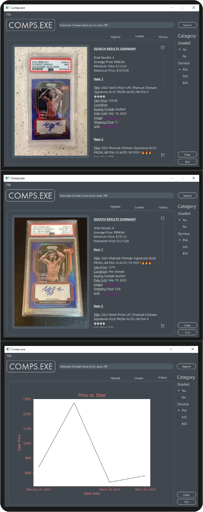
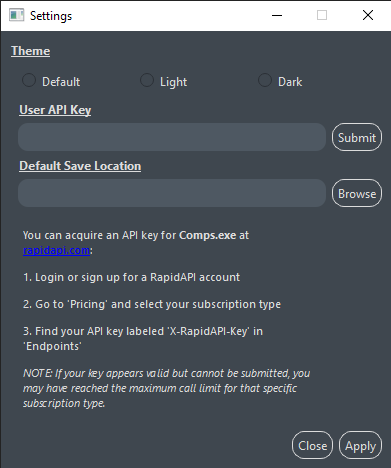

# Comps.exe
## Description
Comps is a trading cards sold price analyzer. This desktop GUI app provides the following information corresponding to the searched trading card:
- The highest and lowest sold price
- A historical price chart to indicate the price trends

    *NOTE: THE API RETRIEVES DATA ONLY FROM EBAY.COM*

## Dependencies (For Contributors)

- PyQt6

        pip install PyQt6

- PIL.Image

        pip install Pillow

- Requests

        pip install requests

- Matplotlib

        pip install matplotlib

- Dotenv (the .env file will be updated based on the key value assigned, see line 140 in main_window.py)

        pip install python-dotenv

- Built in modules: io.BytesIO, re, os, json, csv
- Not a dependency, but Qt Designer was used to customize the GUI. You can find a VSCODE extension 'Qt for Python' which lets you access the designer within the VSCODE

## For Users
- Comps.exe is available in the root project directory. You will need to enter your key in the settings first before you can make searches.

## Instructions
- Enter the name of the trading card along with important attributes (in any order) such as:
    1. Card name (ex. Michael Jordan)
    2. Year (ex. 1986)
    3. Card brand (ex. Fleer)
    4. Card number (ex. #57)
    5. Any other misc. terms which indicate that specific card (ex. Rookie, RC, etc.)
- Press enter or click the 'Search' button.

    *NOTE: YOU CAN ALSO SEARCH ONLY GRADED CARDS USING THE PROVIDED TOGGLES*

## Sample Results
(Top to bottom): Lowest, Highest, History Chart

    

## Saving the Data
- In 'File' the following save options include:
    1. Default save (.txt)
    2. Save as (.txt, .json, .csv)

## Settings Window

- Instructions on acquiring API key are included within the settings window
- Use 'Submit' to assign your key. And keypress 'ENTER' to set your specified default save location.
- Program restart is required before changes apply
    
    *NOTE: THE DEFAULT SAVE LOCATION IS WHERE THE .txt FILE WILL BE SAVED WHEN USING 'Save'. THE APPLIED USER SETTINGS WILL BE STORED IN 'CompsExe' FOLDER LOCATED IN USER DOWNLOADS. AVOID DUPLICATING THE SETTINGS FILE, AS THE PROGRAM SEARCHES FOR A FILE WITH THE USER SETTINGS FILE NAME*

    

## About the API
- Under a BASIC RapidAPI plan, user has a limit of 50 calls per month
- Credits to the official author of the API:

    - https://github.com/colindaniels/eBay-sold-items-documentation#routes

## Other references
- PyQt6 Documentation
    - Riverbank Computing Limited. (2021). PyQt6 Reference Guide. Retrieved April 11, 2023, from https://www.riverbankcomputing.com/static/Docs/PyQt6/
- UI Converter for PyQt6
    - Riverbank Computing Limited. (2021). PyQt6 designer manual: pyuic6. Retrieved from https://www.riverbankcomputing.com/static/Docs/PyQt6/designer.html#pyuic6
- Qt Designer
    - Qt. (n.d.). Qt Designer Manual. Retrieved April 11, 2023, from https://doc.qt.io/qt-6/qtdesigner-manual.html

